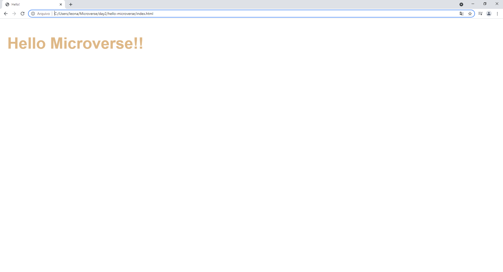

# Hello Microverse

> This is an example of dev and commit using GitHub and Visual Studio.

This project was made using Visual Studio and Github bash functionalities.

## Built With

- Major languages: HTML & CSS
- Frameworks: Visual Studio
- Technologies used: HTML, CSS, Bash

## Live Demo

[Live Demo Link](https://livedemo.com)

## Getting Started

In this project, you will set up a "Hello world" repository. No complex coding is required for this exercise. Your goal here is to master all of the tools and best practices you learned about in previous steps. You will be using them in all Microverse projects and most likely in your future job as well, so it is important to know them!

To get a local copy up and running follow these simple example steps.

### Prerequisites

- Remember to document your work in a professional way.
- Create a new GitHub repo.
- Create a new branch according to the GitHub flow rules.
- Add a .gitignore file.
- Set up a linter for HTML and CSS and make sure that any files that are not relevant are ignored by git.
- Add descriptive README file to your project - please use this template but remember to customize it to your project.
- Add 3 files (each one in a separate commit):
    - A .html file that includes a header with the text "Hello Microverse!"
    - A .css file that includes one class with styles for your header (make it in your favorite color).
    - A test.md file with the text "This file should be ignored by git".
- Make sure that the last file is actually ignored by git and is not present in your GitHub repository.
- Open a pull request.

## Set-up GitHub Actions

Please do the following **steps in this order**:

1. In the first commit of your feature branch create a `.github/workflows` folder and add a copy of [`.github/workflows/linters.yml`](.github/workflows/linters.yml) to that folder.
   - **Remember** to use the file linked above
   - **Remember** that `.github` folder starts with a dot.
2. **Do not make any changes in config files - they represent style guidelines that you share with your team - which is a group of all Microverse students.**
   - If you think that change is necessary - open a [Pull Request in this repository](../README.md#contributing) and let your code reviewer know about it.
3. When you open your first pull request you should see the result of the GitHub actions checks:

### Install

### Usage

### Run tests

### Deployment

## Authors

👤 **Author1**

- GitHub: [@Leonardoeng13](https://github.com/Leonardoeng13)
- Twitter: [@Leo de Andrade](https://twitter.com/andrade_leo)
- LinkedIn: [Leonardo de Andrade](https://linkedin.com/in/leonardodeandrade)

## 🤝 Contributing

Contributions, issues, and feature requests are welcome!

Feel free to check the [issues page](../../issues/).

## Show your support

Give a ⭐️ if you like this project!

## Acknowledgments

- Hat tip to anyone whose code was used
- Inspiration
- etc

## 📝 License

This project is [MIT](./MIT.md) licensed.
